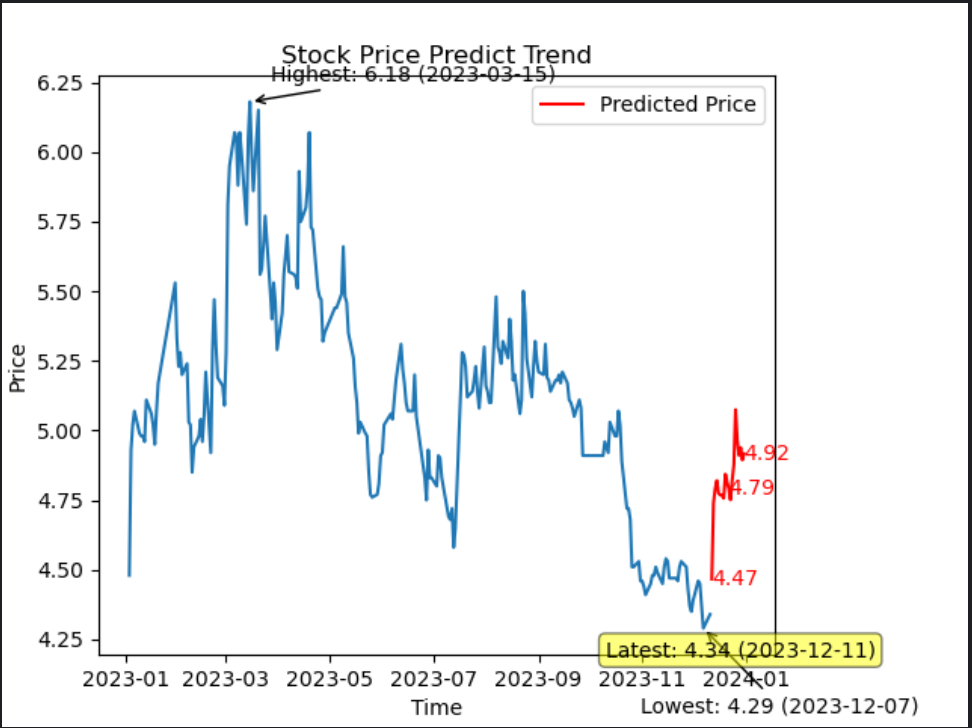

<h1 style="font-size: 24px;">CISC 7201 Course Project</h1>

Author: Yang Hao

Student Number: MC365142

## Introduction

The significance of stock prediction lies in its potential to provide insights and assist in making informed investment decisions. By utilizing various analytical techniques, historical data, and market trends, stock prediction models aim to forecast the future performance of stocks. These predictions can help investors identify potential opportunities, manage risks, and optimize their investment strategies.Stock prediction offers several benefits. Firstly, it allows investors to make proactive decisions by anticipating market movements and identifying potential buying or selling opportunities. It provides a forward-looking perspective that can aid in capitalizing on market trends and maximizing returns.

**The most important aspect is that I have a personal interest in the stock market and actively participate in stock trading. Therefore, I have chosen stock prediction as my topic.**

In this project, I collected the daily closing prices of several stocks from the [Flush website](https://www.10jqka.com.cn/) from 2023.1.3 to 2023.12.12 as a dataset, where the first 90 percent is used as a training set and the last 10 percent as a test set. GRU (Gated Recurrent Unit, a variant of RNN) is used as the main body of the model and the predicted results are visualized using PLT library.

## Requirements

In order to run this program successfully, you need to install the following tools.

- Python 3.10
- Pandas 2.1.1
- Pytorch 2.1.0
- tqdm 4.66.1

## Usage

I have provided a trained model for the SH600050 (China Unicom) stock, you can run main.py directly to get the prediction results. If you want to retrain a model, please run tran.py first to generate the model. Also, if you want to use your own data to train the model, please put the training data into the datasets folder and change the corresponding file path.

## Results Example

We predict the closing price of SH600050 (China Unicom) for the next 20 trading days, and the results are shown in the figure, where the black line indicates the historical data, the red line indicates the prediction result, and the price of the latest trading day (based on the latest date of the dataset), as well as the highest and lowest prices, are also labeled in the figure.

